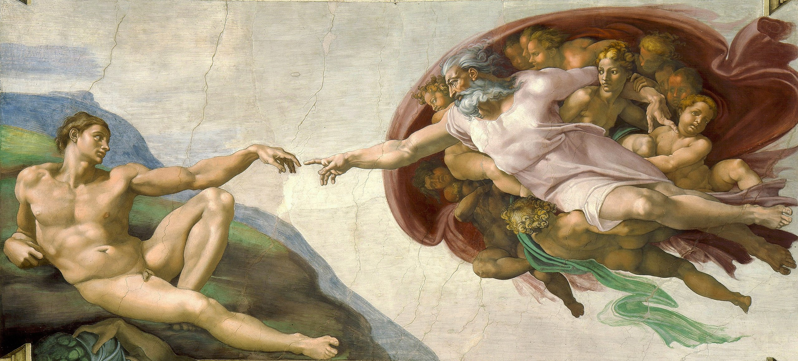
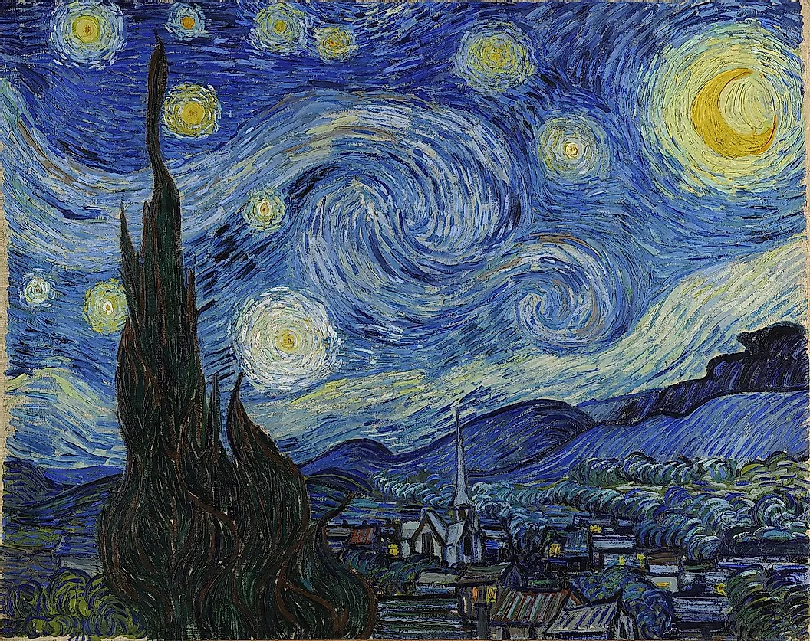

Style_transfer
==============================
It's an attempt at recreating the style transfer method as outlined in the paper [Image Style Transfer Using Convolutional Neural Networks](https://www.cv-foundation.org/openaccess/content_cvpr_2016/papers/Gatys_Image_Style_Transfer_CVPR_2016_paper.pdf).

The style transfer is done by using a pretrained 19-layer VGG network that is made up of series of convolutional and pooling layers.

### Sample of the results

| Content image | Style image   | Result image  |
| :-----------: | :-----------: | :-----------: |
|   |   |   |
|   |   |   |
|   |   |   |
|   |   |   |